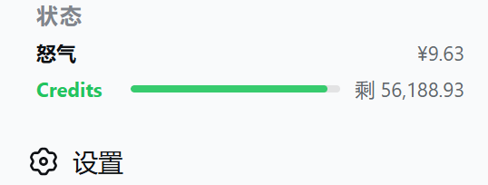
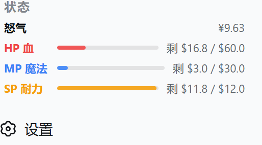
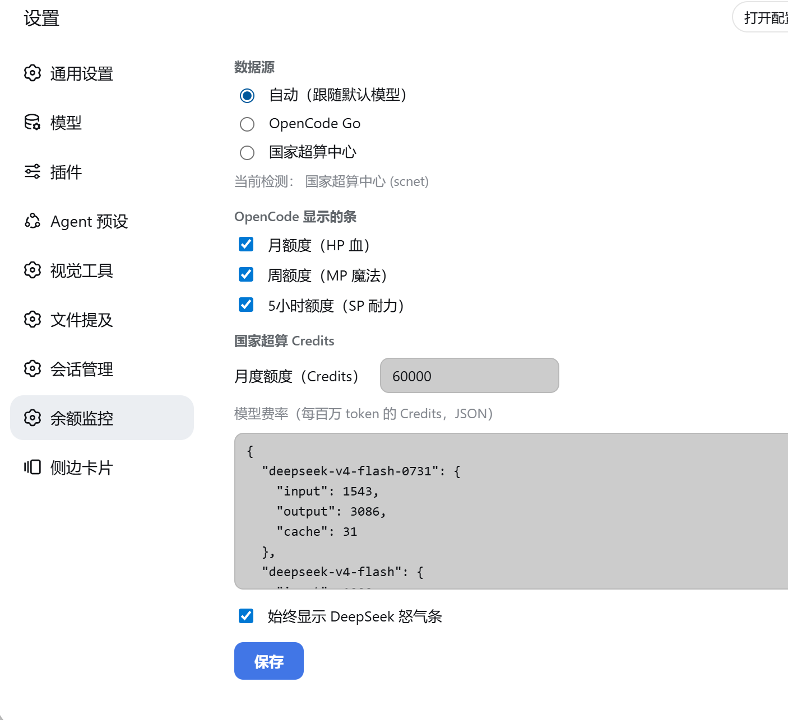

# dsh-plugin-quota-monitor

DSH（DeepSeek Harness）侧边栏底部的**额度与余额监控**插件：一条怒气条 + 各服务商状态条，并在
**设置 → 插件管理 → 余额监控**里提供完整配置页。

RPG 风格的映射：**HP 血（红）= 月额度 · 魔法 MP（蓝）= 周额度 · 耐力 SP（黄）= 5h 额度 · 怒气 Rage（金）= DeepSeek 余额**。

## 预览

| 国家超算中心（scnet · Credits） | OpenCode Go（HP / MP / SP） |
|---|---|
|  |  |

设置页（**设置 → 插件管理 → 余额监控**）：



## 功能

- **怒气 Rage（金，始终显示）**：DeepSeek 官方接口实时余额（`api.deepseek.com/user/balance`），显示 ¥ 剩余金额。
- **OpenCode Go**（`opencode-go`）：官方用量接口的 **月 / 周 / 5h** 三个窗口 → HP / MP / SP，显示剩余 `$` 与细条。
- **国家超算中心（scnet）**：Token Plan **Credits 剩余**（单条，绿色）。scnet **没有公开的用量查询接口**，本插件改为**本地估算**：直接读取 DSH 自己的会话日志（`$DSH_HOME/sessions/**/*.jsonl(.zstd)`，纯 Node 解压 Zstandard 多帧），统计本月经 scnet 消耗的 token，再按 scnet 官方费率表折算成 Credits。
- **自动识别数据源**：默认 `auto` —— 从 DSH `settings.yaml` 的 `agent-default-model.provider` 自动选择（opencode-go / scnet），也可手动指定。
- **设置页**：数据源切换、每个条目的开关、scnet 月度额度与**模型费率表**（JSON 可编辑，含 DeepSeek-V4-Flash-0731 / GLM-5 / Kimi-K3 / MiniMax-M3 / Qwen3.8-Max 等 13 个官方费率）。
- 60 秒轮询 + 切回页面即时刷新；窄侧栏折叠为圆形小徽标。

## 安装

```bash
dsh plugin --profile web add dsh-plugin-quota-monitor-<version>.tgz
# 或从 npm
dsh plugin --profile web add dsh-plugin-quota-monitor
```

重启 dsh web 进程后生效（client bundle 与 host 都需要重启进程，刷新页面不够）。

密钥从环境变量或 `~/.dsh/.credentials.yaml` 读取（环境变量优先）：

| 数据源 | 密钥 |
|---|---|
| DeepSeek 怒气 | `DEEPSEEK_API_KEY` |
| OpenCode Go | `OPENCODE_GO_API_KEY` |
| scnet Credits（本地估算） | 无需密钥，读本地会话日志 |

## 设置

打开 **设置 → 插件管理 → 余额监控**：

- **数据源**：自动（跟随默认模型）/ OpenCode Go / 国家超算中心。
- **OpenCode 显示的条**：月额度（HP）/ 周额度（MP）/ 5h 额度（SP）开关。
- **国家超算 Credits**：月度额度（默认 60,000，基础版）与模型费率表（每百万 token 的 Credits，JSON 编辑）。
- **始终显示 DeepSeek 怒气条**。

配置保存在 `$DSH_HOME/storages/quota-monitor-config.json`。

## 关于 scnet 估算的准确度

- scnet 官方文档确认 Token Plan **没有公开的用量/余额查询 API**，用量只能网页控制台查看。
- 本插件统计的是 **DSH 实际记录的 token 消耗**（每次对话的 `inputTokens / outputTokens / cacheReadTokens`），按 scnet 官方费率表折算，因此会**自动跟随你在 DSH 里的真实使用**，并回填整个自然月。
- 表外模型（如 SCNet-Max、Qwen3.6-Flash、DeepSeek-R1 系列）没有官方公开费率，会用默认费率近似；可在设置页补充费率或调整默认值。
- 如果你只在 DSH 之外用 scnet，这部分用量不包含在内。

## 开发

```bash
npm pack                                   # 打 tarball
dsh plugin --profile web remove dsh-plugin-quota-monitor
dsh plugin --profile web add ./dsh-plugin-quota-monitor-<version>.tgz
```

- `lib/index.js` — host 半：`/balance` RPC 通道（snapshot / opencode / scnet / configGet / configSet / detect）。
- `lib/client.js` — browser 半：侧边栏卡片 + 设置页（手写 classic-script bundle，零构建）。

## 致谢 / 衍生

本项目由 [jelly-000/dsh-balance-monitor](https://github.com/jelly-000/dsh-balance-monitor) 大幅扩展而来（MIT）。

## License

[MIT](./LICENSE)
