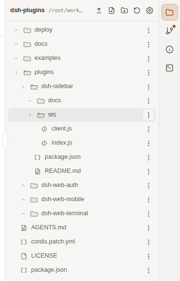

<h1 align="center">dsh-sidebar</h1>

<p align="center">
  <strong>dsh web 右侧边栏：pidance Chamber Native 风格工作区面板（文件 / Git 更改 / 会话信息 / 终端）</strong><br/>
  <a href="https://badgen.net/badge/license/MIT/green"></a>
</p>

---

## 简介

在 dsh web 右侧栏（`details` 插槽）渲染 **pidance Chamber Native 侧边栏规范** 重做的
工作区面板：**44px 常驻图标轨道**（文件 / Git 更改 / 会话信息 / 终端，Git 带变更数角标）
+ 内容面板。行高、整行选中、明暗主题令牌与状态色对齐 pidance 侧边栏实现
（[SessionSidebar](https://github.com/henlii/pidance/blob/main/components/SessionSidebar.tsx) /
[RightPanel](https://github.com/henlii/pidance/blob/main/components/RightPanel.tsx)）：



- **文件**：pidance FileExplorer 同款工具栏（上传 / 新建文件 / 新建文件夹 / 刷新 /
  文件设置）+ 文件树（目录折叠、按类型可辨的单色符号、Git 状态徽标、整行选中态）；
- **文件操作**：行内新建/重命名；行尾「⋯」菜单复制路径、移动、复制、删除；
  目录可拖拽接收文件/目录执行移动；上传支持冲突覆盖 / 跳过；
- **文件设置**：显示隐藏文件、最大扫描深度、最大条目数、忽略目录（逗号分隔），
  配置保存在 localStorage，修改后立即刷新文件树；
- **Git 更改**：分支 + 变更列表（冲突/修改/新增/删除/重命名/未跟踪排序），
  状态码与文字双重标注，点击文件 → diff 视图（未跟踪文件显示内容预览）；
- **会话信息**：上下文用量进度条、会话统计、工作区 / 路径 / 会话 id / 预设 / Git 状态；
- **终端**：对齐 pidance TerminalPanel 的状态条 + 同色底 + 底栏 chips
  （依赖 dsh-web-terminal 的宿主 RPC；直接输入、Enter 执行、Ctrl-C 中断，
  仍是 REPL 不是 xterm 原始模式）；
- **二级编辑**：点击文件展开编辑视图（textarea + 保存 / Ctrl+S），或 diff 视图
  （增删行着色），返回按钮回列表。

> 注意：注册 `details` 插槽会**替换**官方右侧栏的工具详情面板（方案 A，single 插槽语义）。

## 视觉规范

对齐 pidance Chamber Native 明暗主题令牌（浅色暖纸白 / 深色暖墨色）：

- 内容面板 44px 头栏，文件 / Git 行高 28px、6px 圆角，选中态整行
  `--dsh-sb-selected`；
- 44px 常驻轨道：文件夹 / Git 分支 / 信息圆 / 终端方框，active 用选中面 + accent 色；
- 文件树 16px 单色类型符号（代码 `</>`、数据 `{}`、文档、锁等），不用纸张 + 字标；
- 终端：面板同色底、11px 状态条、30px 底栏 chips、accent 块光标；不用独立黑底；
- 暗色跟随 dsh 宿主 `body[data-ds-dark-theme]`，无需插件配置；
- Git 状态色只作辅助编码，始终同时显示状态码与中文状态文字。

## 安装

**独立安装：**

```sh
dsh plugin --profile web add /path/to/dsh-plugins/plugins/dsh-sidebar
```

**或全部安装（集合）：**

```sh
dsh web --patch /path/to/dsh-plugins/cordis.patch.yml
```

然后在 `$DSH_HOME/profiles/web/cordis.patch.yml` 增加（或确认已在集合 patch 中）：

```yaml
- insert:
    - id: sidebar
      name: 'dsh-sidebar'
```

安装后刷新页面，打开右侧栏（布局开关）即可看到面板。

> 建议与 **dsh-web-auth** 一起部署：该插件的 `/api/dsh-sidebar/*` 路由会被
> dsh-web-auth 的密码认证自动保护（非回环访问需登录）。无认证层部署时这些路由
> 在局域网内是开放的（文件读/写），注意访问边界。

## 能力

| 能力 | 说明 |
|------|------|
| 工作区文件树 | 当前会话 `header.cwd` 的文件树，目录折叠、按类型可辨的单色符号、Git 状态徽标 |
| 文件操作 | 新建文件/文件夹、重命名、移动、复制、删除、拖拽移动、目录选择器 |
| 上传 | base64 JSON 上传，预检冲突后支持覆盖/跳过，单文件上限 32 MB、最多 60 个 |
| 文件设置 | 显示隐藏文件、最大深度、最大条目数、忽略目录，localStorage 持久化 |
| Git 状态 | `git status --porcelain` 解析：分支、变更列表（index/worktree 字母） |
| 文件 diff | `git diff -- <path>`；未跟踪文件显示内容预览 |
| 二级编辑 | 点击文件展开编辑器（读取 → textarea → 保存/Ctrl+S → 刷新树）；diff 增删行着色 |
| 常驻菜单条 | 右缘 44px 图标轨道，Git 变更数角标，面板收起仍显示 |
| 明暗主题 | pidance Chamber Native 令牌，暗色跟随 `body[data-ds-dark-theme]` |

## 安全边界

- 数据走 `/api/dsh-sidebar/*` 精确路由（dsh-ssh 同款模式）；
- 推荐与 dsh-web-auth 同装，由其密码认证门禁保护（回环免密）；
- 无认证部署时路由开放，仅建议在受信内网使用。

## 插件管理

已装插件推荐用 [plugin-registry](https://github.com/vlln/plugin-registry) 的**薄控制台**
管理安装态，无需手改配置：

```sh
dsh plugin --profile web add "github:vlln/plugin-registry#main&path:/packages/plugin/console"
```

## License

[MIT](../../LICENSE) © 2026 Henry Li

> 文件操作路由与读/写路由一样，先解析会话 cwd 并做 realpath 围栏；
> 删除/覆盖操作不可撤销，客户端均有确认或冲突提示。
